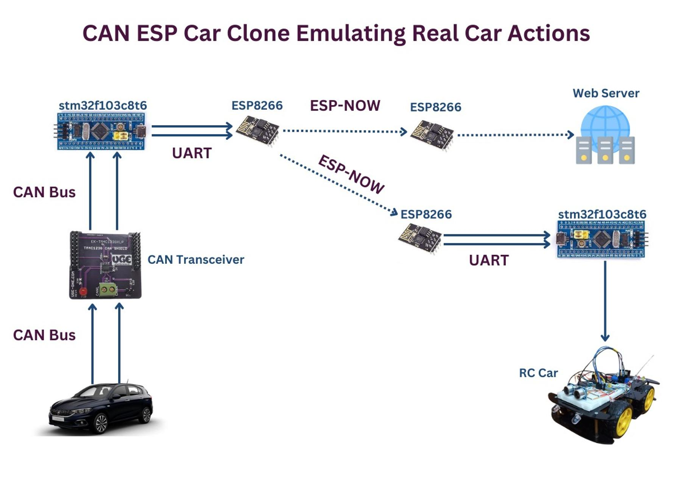

## EME - Egypt Makes Electronics
## SEITech Solutions

### Team Members
- Hossam Elwahsh -  
- Ahmed Sakr - 
- Ahmed Hisham - 
- Nada Salloum - 
- Salma Faragalla - 
- Norhan Mohamed -  

### CAN ESP Car Clone: Emulating Real Car Actions
- Tapping into the high speed can bus of a (Fiat Tipo 2019), clone, process and sends certain car actions to an RC car for it to emulate, 
- Actions including: (throttle position, steering wheel position, current transmission selection, selection of car lighting).
- Utilizing 2x STM32 microcontrollers running FreeRTOS along with two ESP8266 chips communicating over ESP-NOW protocol to minimize delay, one of which has an active webserver introducing a quick monitor system that can be accessed by connecting to a certain WIFI SSID with the correct password and a static IP address to access the monitoring webpage showing RC car status in real-time.

### Dist Files

| ECU | APP                                  | MC          | OS                      | Description                                                                                                                                                                                                                                  | Build File                                 |
|-----|--------------------------------------|-------------|-------------------------|----------------------------------------------------------------------------------------------------------------------------------------------------------------------------------------------------------------------------------------------|--------------------------------------------|
| 1   | [HS CAN Processor](/stm32_real_car)  | STMF103C8T6 | FreeRTOS Kernel V10.0.1 | Handles monitoring, analyzing and processing of a real car high speed can bus messages, mapping and queueing certain actions to be sent over to ESP8266 using UART which will later send the queued actions via ESP-NOW to the RC Car System | [hex](dist/hspd_can_processor.hex)         |
| 2   | Data Transfer                        | ESP8266     | -                       | Transfers data from ECU (1) to ECU (3)                                                                                                                                                                                                       | [ino](dist/sender.ino)                     |
| 3   | Data Transfer + Webserver            | ESP8266     | -                       | Transfers data received from ECU (2) to ECU (4) as well as handling a monitoring webserver GUI showing the current status of the RC Car                                                                                                      | [ino](dist/rc_receiver_plus_webserver.ino) |
| 4   | [RC Car Controller](/stm32_rc_car)   | STMF103C8T6 | FreeRTOS Kernel V10.0.1 | Controls and handles RC Car based on the received action data from ECU (3) to replicate/clone the requests sent on the high speed can bus of the real Fiat Tipo ECU (1)                                                                      | uploading                                  |

---
## Documentation
- Google Docs 👉 [GDocs](https://docs.google.com/document/d/1N5tMpMfzq1cyudIZ9OWSpMu_TuF-nQUE03dgVKXzXog/edit?usp=sharing)
- PDF 👉 [V2V Communication - emulating real car actions.pdf](dist/V2V%20Communication%20-%20emulating%20real%20car%20actions.pdf)

## System Layout

## System Flow
1. CAN Transceiver is connected to the Fiat Tipo HS-CAN bus lines via pins `6` and `14` in the OBD-II connector (HS-CAN speed: 500kbps)
2. The CAN Transceiver forwards the CAN messages sent by different ECUs in the Fiat Tipo to the STM32 microcontroller.
3. The STM32 microcontroller filters and passes only certain CAN IDs, maps them to different values to downsize them to a single byte for faster transfers over UART.
4. STM32 sends the single bytes data to ESP8266 which utilizes ESP-NOW protocol to broadcast the data to RC Car ESP8266 as well as another ESP running a webserver with a monitoring GUI.
5. RC Car STM32 receives the data from UART, processes the required action mimicking actions done on the fiat tipo car.

### General Operational Notes
- An additional safety feature has been added to prevent the car from hitting obstacles even if the throttle is pressed the RC car system will override the command and prevent further movement in that direction until the obstacle has been removed (this is handled both ways front and rear using ultrasonic sensors)

---

### Future Improvements
- Engage brakes automatically if the car is drifting (on neutral) towards an obstacle.
- Automatic corner lights with steering.
